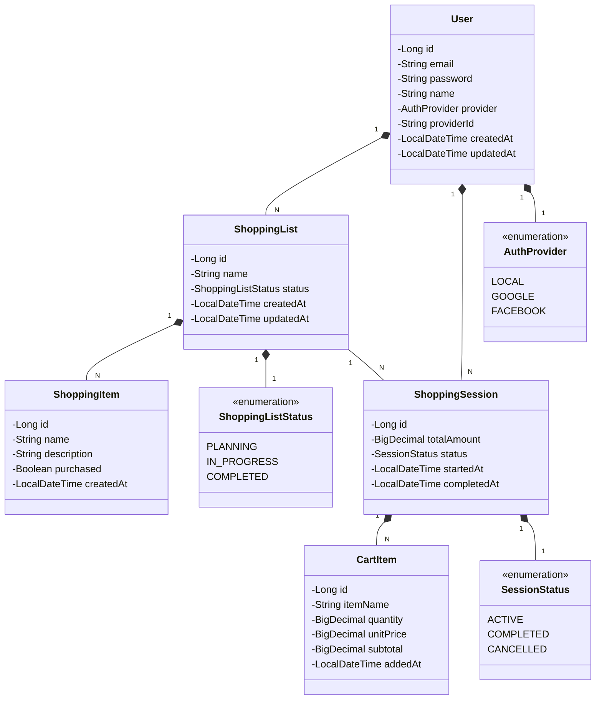

# Shopping List API

API for intelligent shopping list management with real-time cost tracking.

## Principais Tecnologias
 - **Java 21**: Utilizaremos a versão LTS mais recente do Java para tirar vantagem das últimas inovações que essa linguagem robusta e amplamente utilizada oferece;
 - **Spring Boot 3**: Trabalharemos com a mais nova versão do Spring Boot, que maximiza a produtividade do desenvolvedor por meio de sua poderosa premissa de autoconfiguração;
 - **Spring Data JPA**: Exploraremos como essa ferramenta pode simplificar nossa camada de acesso aos dados, facilitando a integração com bancos de dados SQL;
 - **OpenAPI (Swagger)**: Vamos criar uma documentação de API eficaz e fácil de entender usando a OpenAPI (Swagger), perfeitamente alinhada com a alta produtividade que o Spring Boot oferece;
 - **Spring Security**: Para autenticação e autorização.
 - **Flyway Migration**: Para versionamento do banco.

### [Link do Spring initializr com a configuração inicial do projeto](https://start.spring.io/#!type=maven-project&language=java&platformVersion=3.5.4&packaging=jar&jvmVersion=21&groupId=com.shoppinglist&artifactId=shopping-list-api&name=Shopping%20List%20API&description=API%20for%20intelligent%20shopping%20list%20management%20with%20real-time%20cost%20tracking&packageName=com.shoppinglist.api&dependencies=web,security,oauth2-client,data-jpa,flyway,devtools,configuration-processor,postgresql,h2)
### [Link do Claude AI](https://claude.ai/)

O Claude AI é um sistema de inteligência artificial desenvolvido pela Anthropic e foi utilizado para a abstração do domínio desta API, sendo útil na análise, projeto da solução e elaboração do Diagrama de Classes utilizando a sintaxe Mermeid.

## Diagrama de Classes (Domínio da API)

## IMPORTANTE

Este projeto está sendo construído com um viés educacional. 👊🤩